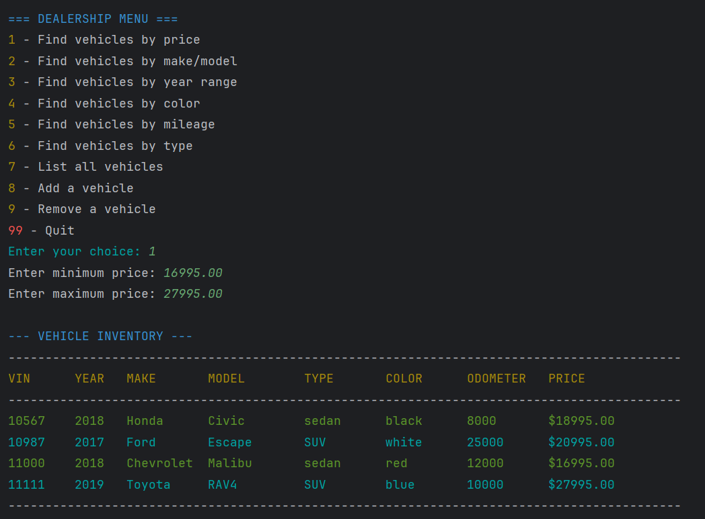
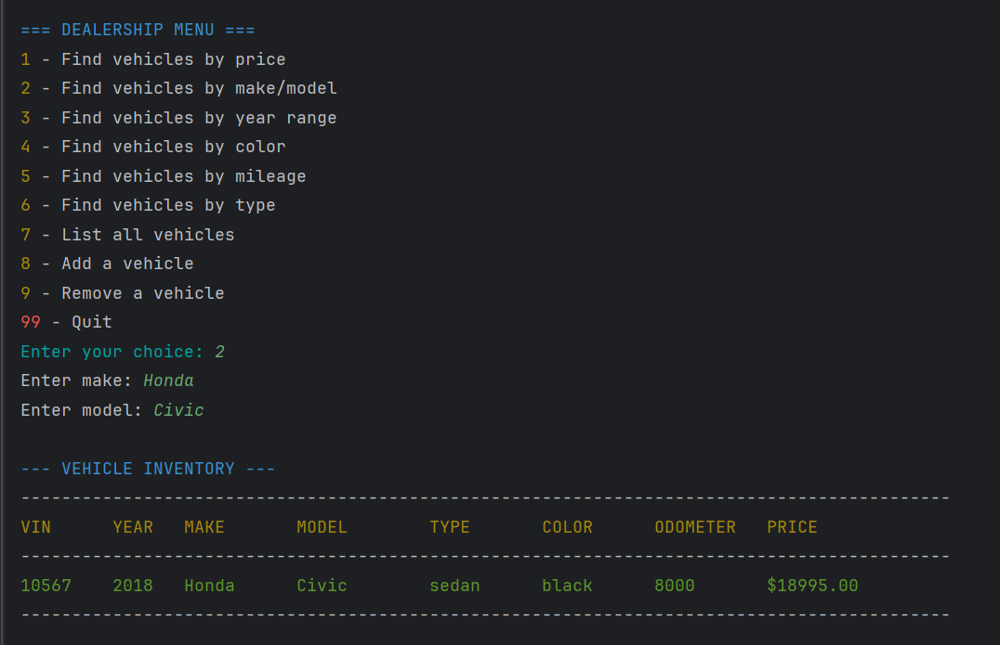
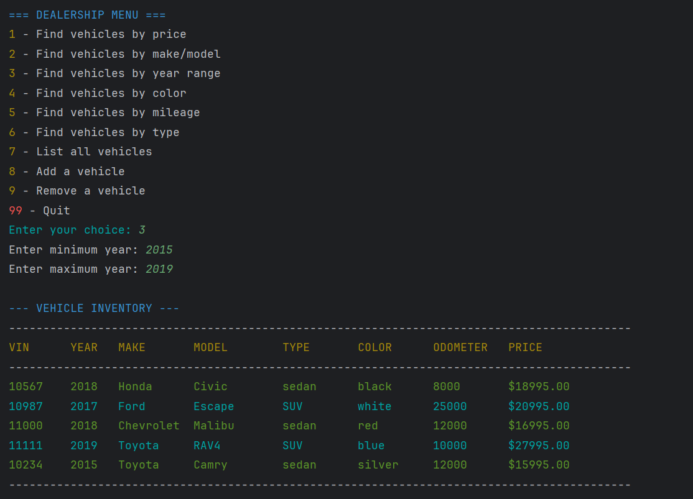
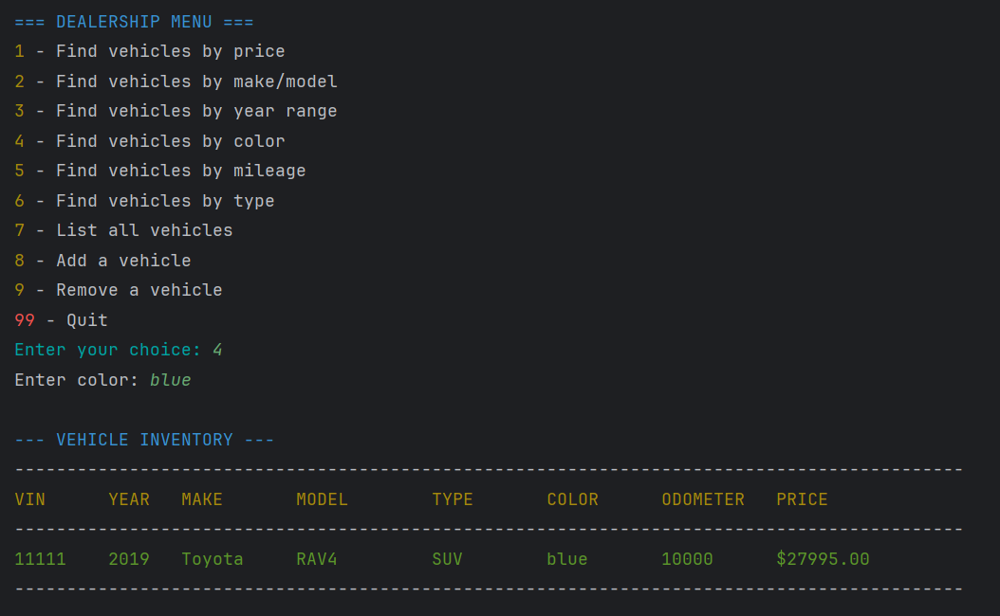
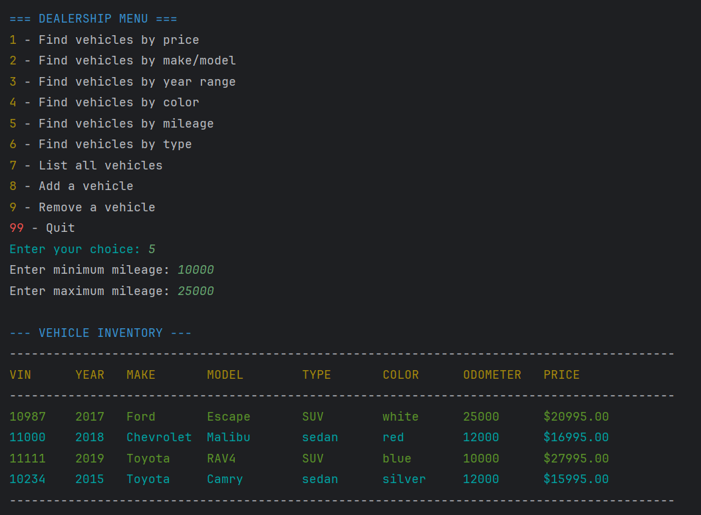
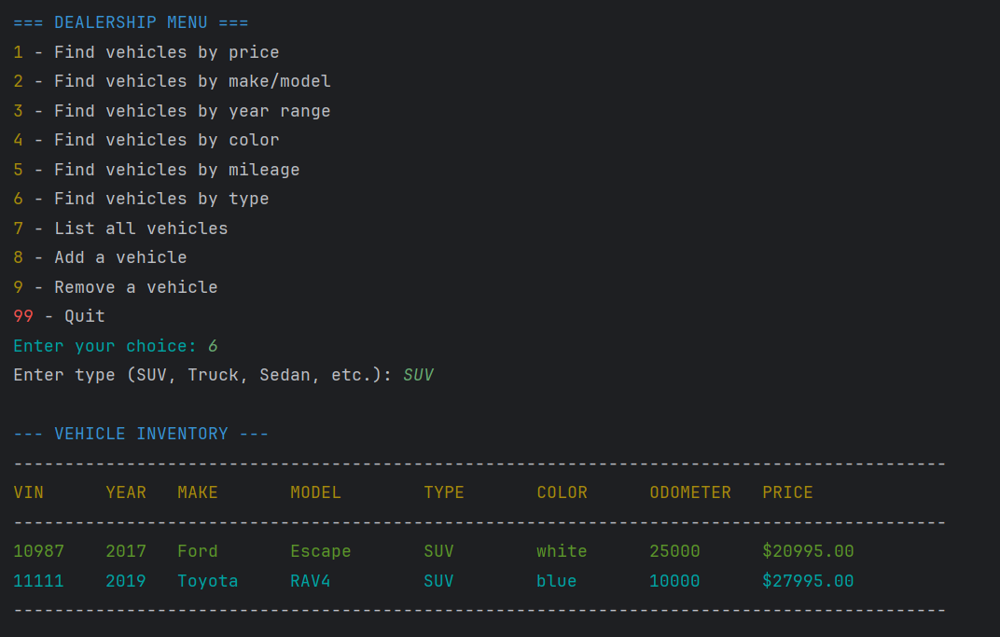
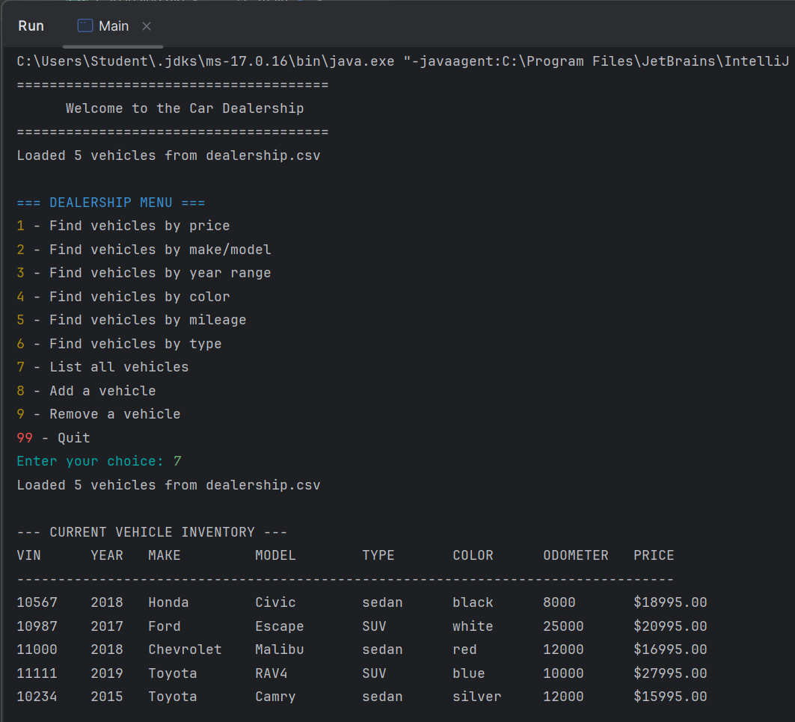
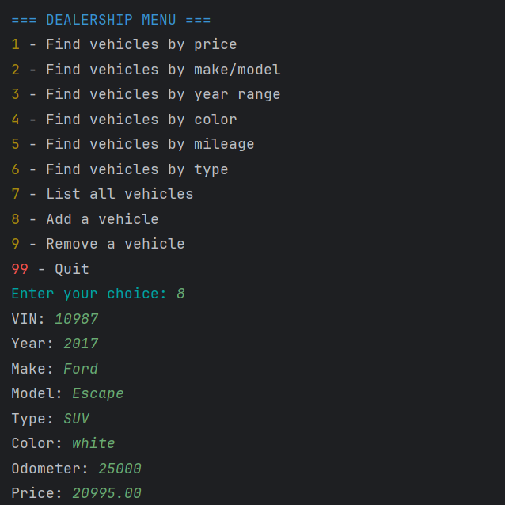
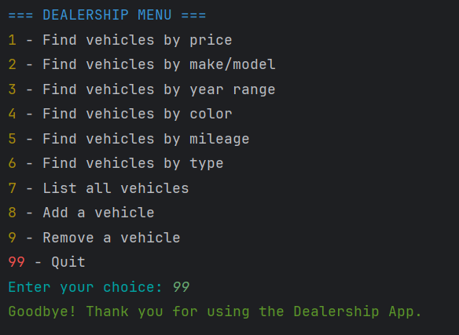

## Car Dealership Console Application

### Description of the Project

This Java console application simulates a used car dealership management system. It allows users to search, view, add, and remove vehicles from a dealership’s inventory. 
The application loads data from the Dealiership.csv file that stores dealership information and all vehicle details such as VIN, year, make, model, type, color, odometer, and price. Its purpose is to help dealership employees manage inventory efficiently without needing a graphical interface. The intended users are dealership staff or sales representatives who need quick access to inventory data. 
The main functionality includes searching vehicles by multiple filters (price, make/model, year, color, mileage, and type), viewing all inventory, and saving updates back to the CSV file automatically. This project solves the problem of manual record-keeping by digitizing dealership inventory in a simple, text-based interface.

### User Stories

- As a user, I want to be able to load all dealership data from a file, so that I can view and search vehicles.
- As a user, I want to find vehicles by price range, so that I can offer cars that fit a customer’s budget.
- As a user, I want to search by make and model, so that I can quickly locate specific vehicles.
- As a user, I want to filter vehicles by year, color, mileage, or type, so that I can meet customer preferences.
- As a user, I want to add a new vehicle, so that new arrivals are immediately added to the dealership’s records.
- As a user, I want to remove a sold vehicle, so that the inventory file remains accurate.
- As a user, I want all data to be saved automatically to the CSV file, so that no information is lost.
- As a user, I want to be able to input my data, so that the application can process it accordingly.
- As a user, I want to receive immediate feedback, so I can understand what to do next.

### Setup
Instructions on how to set up and run the project using IntelliJ IDEA.

#### Prerequisites
- IntelliJ IDEA: Ensure you have IntelliJ IDEA installed, which you can download from here.
- Java SDK: Make sure Java SDK is installed and configured in IntelliJ.
  
#### Running the Application in IntelliJ
Follow these steps to get your application running within IntelliJ IDEA:
1. Open IntelliJ IDEA.
2. Select "Open" and navigate to the directory where you cloned or downloaded the project.
3. After the project opens, wait for IntelliJ to index the files and set up the project.
4. Find the main class with the `public static void main(String[] args)` method.
5. Right-click on the file and select 'Run 'YourMainClassName.main()'' to start the application.

### Technologies Used
- Java SE 17 (Microsoft Build) – Used to develop and run the entire console application.
- IntelliJ IDEA Community Edition 2025.2 – The IDE used to write, debug, and run the project.
- Core Java Libraries –
  - java.io for reading/writing the Dealership.csv file.
  - java.util for collections and scanner input.
  - java.time for date/time utilities).
- CSV File Storage – Persistent data storage using a pipe-delimited CSV file that holds all dealership and vehicle data.
- ANSI Color Codes – Used in UserInterface to display colored menus and success/error messages in the terminal.

### Demo

Below are screenshots showing the Car Dealership console application running in IntelliJ IDEA.  
Each figure demonstrates one of the main features required in the Workbook 4 Workshop project.

---

#### **Figure 1 – Program Start and Main Menu (Option 7: List All Vehicles)**
Displays the welcome message and main menu after loading vehicle data from `dealership.csv`, followed by a full list of current inventory.

---

#### **Figure 2 – Find Vehicles by Price Range (Option 1)**
Shows user input for minimum and maximum price, and the resulting filtered vehicle list.

---

#### **Figure 3 – Find Vehicles by Make and Model (Option 2)**
Demonstrates searching for a specific make and model (e.g., *Honda Civic*).

---

#### **Figure 4 – Find Vehicles by Year Range (Option 3)**
Filters the inventory to display vehicles between a chosen year range.

---

#### **Figure 5 – Find Vehicles by Color (Option 4)**
Shows filtering vehicles by color (e.g., *blue*).

---

#### **Figure 6 – Find Vehicles by Mileage (Option 5)**
Displays vehicles that match a specific mileage range.

---

#### **Figure 7 – Find Vehicles by Type (Option 6)**
Filters the inventory by type (e.g., *SUV*).

---

#### **Figure 8 – Add a Vehicle (Option 8)**
Illustrates adding a new vehicle to the dealership and saving it to the CSV file.

---

#### **Figure 9 – Exit the Application (Option 99)**
Shows the user exiting the program after completing their actions.

---

### Future Work
- Add input validation for better error handling.
- Implement sorting features (e.g., sort by price or year).
- Add a search history or reporting system (e.g., total inventory value).
- Create a graphical user interface (GUI) using JavaFX or Swing.
- Integrate with a database (e.g., MySQL) for more advanced data management.

### Resources
* Java Programming Tutorial 
* Effective Java by Joshua Bloch
* IntelliJ IDEA User Guide

### Team Members
Wardah Javid – Designed and developed all classes, implemented file I/O and search features, and completed testing and documentation for the Car Dealership console application.

### Thanks
Thank you to the Pluralsight instructors for structured lessons and project guidance.
A special thanks to mentors and peers for support and feedback throughout the capstone workshop.

